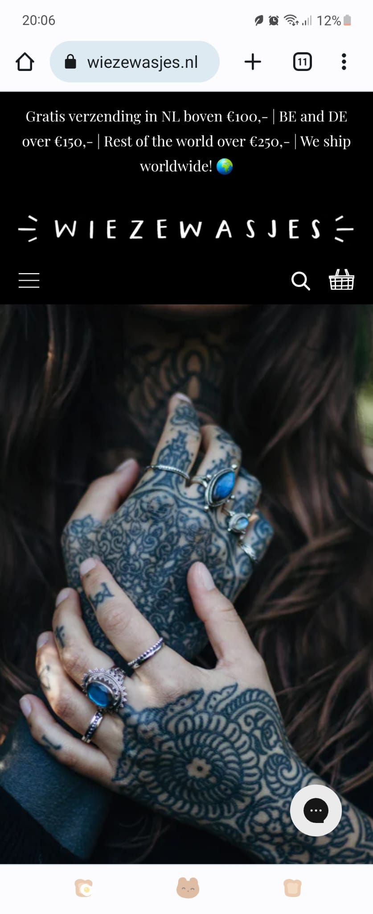
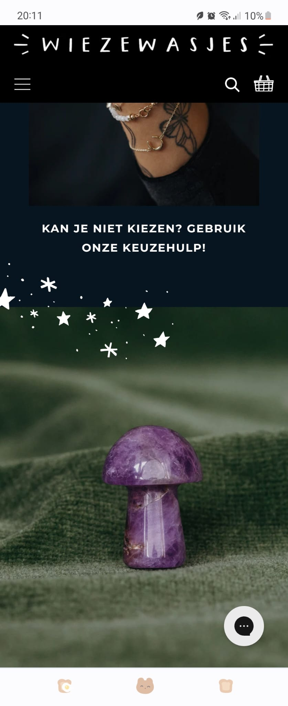
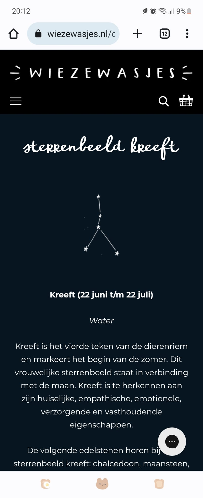
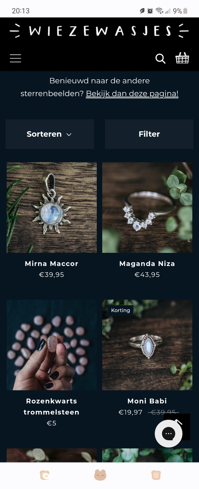
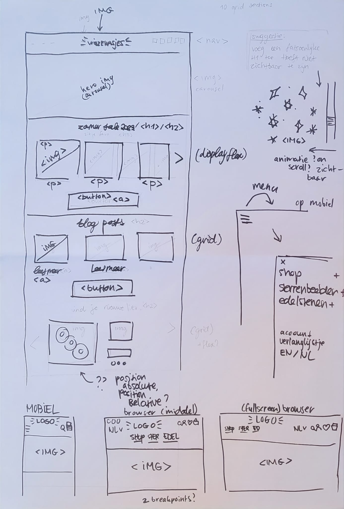
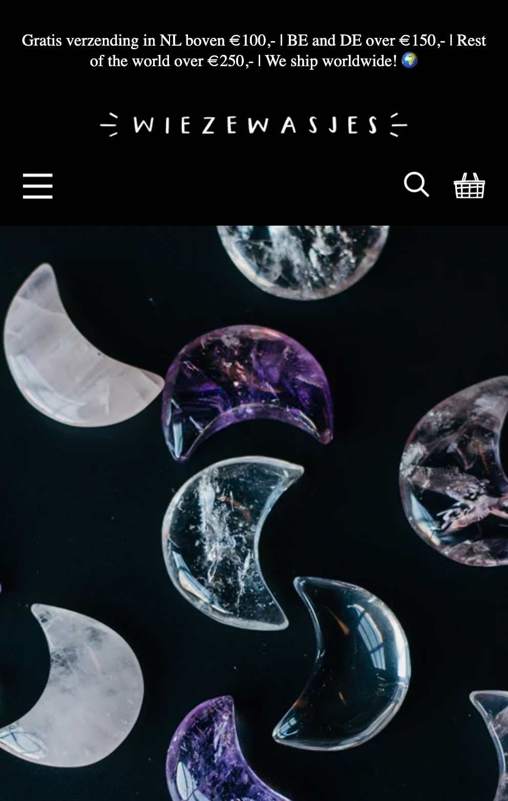
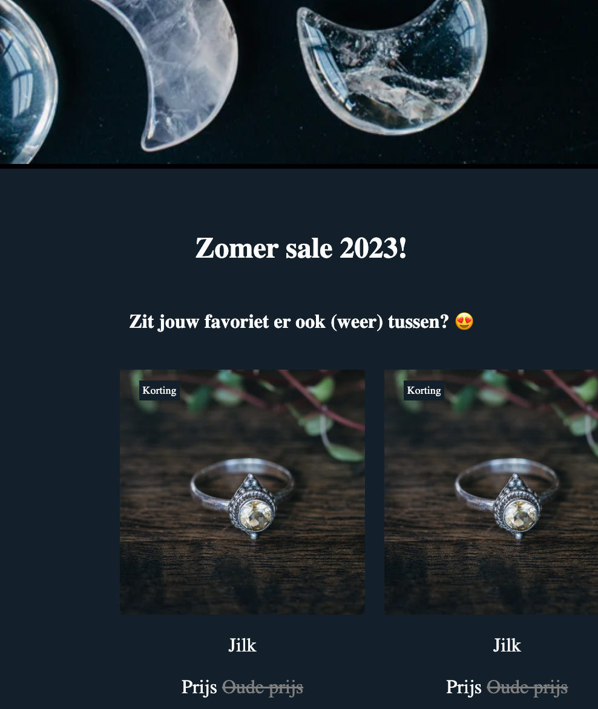
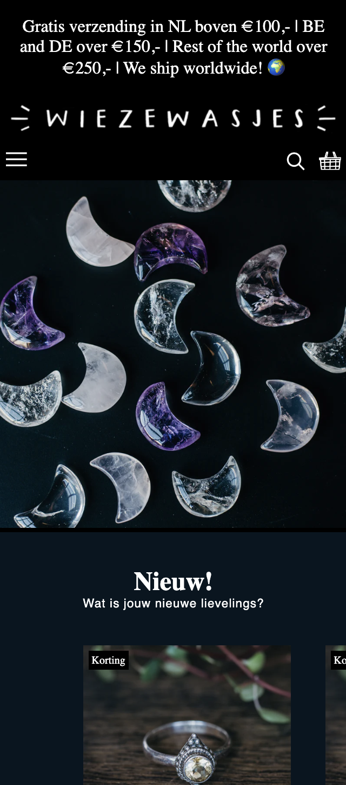
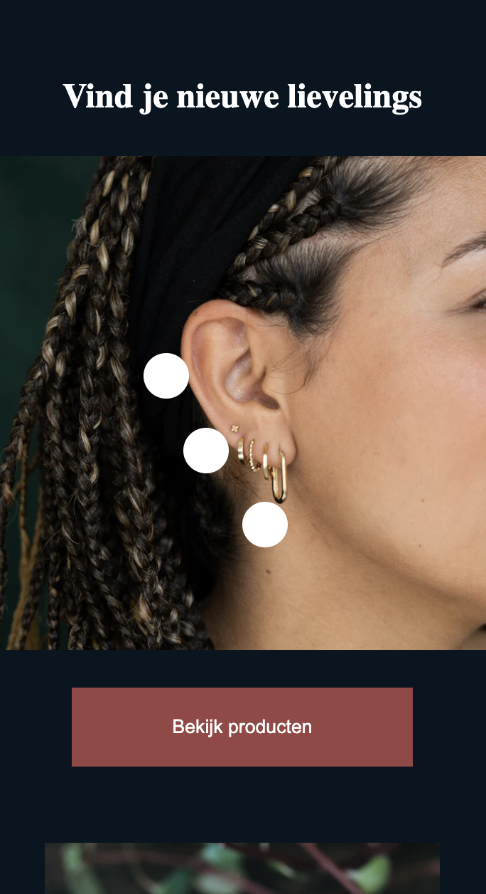
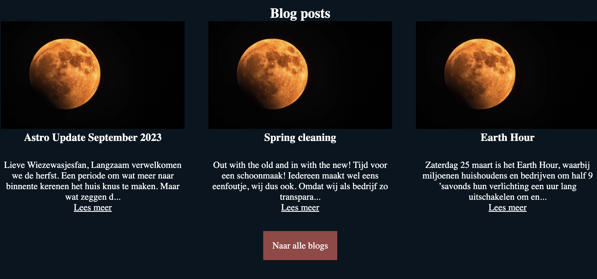

# Procesverslag
Markdown is een simpele manier om HTML te schrijven.  
Markdown cheat cheet: [Hulp bij het schrijven van Markdown](https://github.com/adam-p/markdown-here/wiki/Markdown-Cheatsheet).

Nb. De standaardstructuur en de spartaanse opmaak van de README.md zijn helemaal prima. Het gaat om de inhoud van je procesverslag. Besteedt de tijd voor pracht en praal aan je website.

Nb. Door *open* toe te voegen aan een *details* element kun je deze standaard open zetten. Fijn om dat steeds voor de relevante stuk(ken) te doen.

## Jij

  
uitwerken voor kick-off werkgroep

  ### Auteur:
  Eva Vrieze

  #### Je startniveau:
  Blauw (rood als het me lukt)

  #### Je focus:
  Responsive
 

## Je website

  
uitwerken voor kick-off werkgroep

  ### Je opdracht:
  https://www.wiezewasjes.nl/

  #### Screenshot(s) van de eerste pagina (small screen): 
  
  

  #### Screenshot(s) van de tweede pagina (small screen):
  
  
 

## Toegankelijkheidstest 1/2 (week 1)

  
uitwerken na test in 2e werkgroep

  ### Bevindingen
  Lijst met je bevindingen die in de test naar voren kwamen:

- Ontzettend veel errors en warnings (300+).
- Code werkt ondanks de errors en warnings wel.
- De site is helemaal niet semantisch correct opgebouwd. Ik ga mijn best doen om dat wel te doen. 
- Deze website is gemaakt met shopify. 
- De website bevat veel decoraties die tijdens het scrollen in beeld komen. 
- Website is best responsive, je ziet plaatjes veranderen van plaats wanneer je telefoon gebruikt en dat is een fijnere ervaring.
- Er heerst goed contrast op de pagina, dus het is prettig leesbaar.

(De tweede toegankelijkheidstest is grotendeels ook gedaan, zie pdf in het zipje)

## Breakdownschets (week 1)

  
uitwerken na afloop 3e werkgroep

  ### de hele pagina: 
  Dit was de gehele pagina. De pagina bestaat heeft een navigatie met een submenu dat uitklapt bij de hover. 
  
  

  ### dynamisch deel (bijv menu): 
  Ook is er een hamburger menu op een klein formaat (zoals telefoon). Andere onderdelen verdwijnen dan. Ik zal dus veel gebruik moeten maken van, denk ik, display none.

  ### wellicht nog een dynamisch deel (bijv filter): 
  Er zijn meerdere kleine animaties op de website, zoals bijvoorbeeld bij het onderdeel 'Vind je nieuwe lievelings'.

## Voortgang 1 (week 2)

  
uitwerken voor 1e voortgang

  ### Stand van zaken
  Ik heb een beginnetje van de website opgezet. Ik moest even inkomen. Ik had wel eerder met flexbox gewerkt maar Grid niet. In theorie snap ik het wel maar in de praktijk vind ik het nog lastig om toe te passen.

  ### Agenda voor meeting
 Er is geen Agenda gemaakt voor de Meeting. Wel heb ik met Marten gesproken over wat ik nog moest aanpassen.

  ### Verslag van meeting
  hier na afloop snel de uitkomsten van de meeting vastleggen

  - Ik moet vooral letten op hoe ik de items aanspreek. 
  - Geen Divs/classes/Ids
  - Gebruik ook eens grid ipv flexbox
  
  Ik had een hoop werk te doen, want in principe had ik de opdracht een beetje verkeerd begrijpen. De noodzaak van het gebruiken van bestaande veelvoorkomende HTML5-semantische elementen was nog niet doorgedrongen. Ik zal dit aanpassen in de komende weken.
  
  Het belangrijkste deze week is dat ik elementen juist aanspreek en niet onnodig div's, classes en id's gebruik.

## Voortgang 2 (week 3)

  
uitwerken voor 2e voortgang

  ### Stand van zaken
  Het lukte mij niet om bolletjes te plaatsen bovenop een foto. Deze bolletjes hebben een transparante overlay die bewegen. Het lukt me maar niet om deze responsive te krijgen. Ook wil ik weten of nu mijn website semantisch correct is en of ik de juiste items aanspreek in mijn css.

  Het is gelukt om op een semantische manier code te schrijven. 

  ### Agenda voor meeting
  Mijn vraag was vooral of mijn html nu semantisch correct is, zodat ik weet dat ik op de goede weg ben. 

  ### Verslag van meeting
  Hier na afloop snel de uitkomsten van de meeting vastleggen
  Ik spreek nu mijn items juist aan. Echter heb ik nog veel te doen; ik loop hierdoor een beetje achter. Verder is het het plan om de website verder responsive te maken en een micro animatie toe te voegen. Dit kan bijvoorbeeld door een hartje te kunnen geven aan een element, wat een microanimatie veroorzaakt op de pagina. 

## Toegankelijkheidstest 2/2 (week 4)

  
uitwerken na test in 9e werkgroep

  ### Bevindingen
  Lijst met je bevindingen die in de test naar voren kwamen (geef ook aan wat er verbeterd is):
  - Ik heb een paar warnings, dat komt omdat ik niet overal een alt heb had staan. 
  - Mijn H1 had ik bijvoorbeeld op display: none; staan, omdat ik een H1 op de pagina moest hebben maar deze niet zichtbaar wilde. 
  Dat bleek niet de juiste manier van werken te zijn dus ik heb dit aangepast naar een .sr-only class.
- Alt tags bij alle images nodig.

## Voortgang 3 (week 4)

  
uitwerken voor 3e voortgang

  ### Stand van zaken
  Ik dacht grid goed te begrijpen maar ik loop soms toch tegen dingen aan: Ik probeer eigenlijk vanalles 'as I go' en kijk ook tutorials, maar het klikt nog niet echt.

  *Toevoeging:
  Deze week struggelde ik een beetje met code, het lukte mij niet om de puntjes op de 'i' te zetten en ging er dus eigenlijk al vanuit dat ik moest herkansen. 

  ### Agenda voor meeting
  Geen agenda toendertijd gemaakt.

  ### Verslag van meeting
  hier na afloop snel de uitkomsten van de meeting vastleggen

  - Ik had niet zoveel, maar wat ik had was wel goed. 
  - Probeer het responsive te maken
  - Probeer een microanimatie toe te voegen

## Eindgesprek (week 5)

  
uitwerken voor eindgesprek

  ### Je uitkomst - karakteristiek screenshots:
  
  

  ### Dit ging goed/Heb ik geleerd: 
  Uiteraard gewone html en gewone css opzetten ging best goed. Ik vond het gebruik van var super handig, omdat je op die manier css heel snel bij verschillende onderdelen kunt toepassen. Ook heb ik geleerd en beseft hoe belangrijk is dat we rekening houden met slechtzienden (en slechthorenden en minderbeperkten)

  ### Dit was lastig/Is niet gelukt:
  Ik heb niet te weinig tijd gehad, maar vanwege een vervelende (opstapeling) van gebeurtenissen had ik eigenlijk geen zin (of eigenlijk: de energie niet) meer om te leren. Ik wil heel graag goed worden hierin en hoop een mooie comeback te maken tijdens de herkansing. Wat is super lastig vond en vind is leren hoe grid werkt: soms denk ik het een beetje te snappen en soms niet. Javascript blijft ook nieuw voor me. *Update na eindgesprek: Ik heb het idee dat ik beiden inmiddels beter begrijp! 

## Herkansing aanpassingen 

## Wat was mijn feedback?
Helaas, ik heb het vak niet gehaald. Wel kreeg ik duidelijk te horen wat ik nog moest aanpassen voor een voldoende:
- Werk je verslag bij
- Valideer je website door middel van de validator
- Voeg een micro animatie toe (door bijvoorbeeld een hartje te kunnen geven aan een item)
- Verander 'display: none' aspecten naar een screenreader only class.
- Geef alle a's een alt tag
- Werk verder aan de responsiveness van je website.

### Wat heb ik allemaal gedaan?: 

(Ik heb met de studentenassistente gebeld om kleine issues die ik niet zo snel zag uit te pluizen.)

- UNDERLINE

Ik heb een leuke onderline gecreëerd voor het menu, omdat de echte website dit ook heeft. Dit heb ik gedaan door een tutorial te volgen, maar ik begreep wel wat er gebeurde en paste dit aan naar mijn eigen voorkeuren. Als het ware voeg je een leeg stukje toe (content: '';) dat je relative maakt aan de link zelf, door deze vervolgens te positioneren op de juiste plek, een transition toe te voegen en een opacity van 0 naar 1 krijg je een leuk effect. Deze truc ga ik toevoegen aan mijn eigen portfolio website!

- HAMBURGERMENU

Ik heb nu bij een kleiner formaat scherm een hamburger menu. Dat was opzich redelijk te doen via een @media, het duurde iets langer om door te krijgen hoe ik er nou precies voor zorg dat het hamburgermenu daadwerkelijk uitschuift wanneer ik op het hamburgermenu Icon klik. Dat bleek, na even googlen en youtuber, makkelijker zijn dan ik dacht. Je plaatst het menu als het ware standaard 'uit beeld' door een positie -300px (of iets in die richting) te geven en zegt, door middel van JS, dat wanneer er geklikt wordt deze positionering van -300px verandert naar 0. 

- SUBMENU

Ik heb een submenu gecreëerd. Wel met behulp van ChatGPT, omdat ik javascript soms nog moeilijk vind (Het is vrij nieuw voor me, vergeleken met enkél HTML & CSS). Met alleen :hover display: block kwam ik er niet uit. Ik zal de volledige tekst in de bronnenlijst plaatsen. Ik begrijp in grove lijnen wel wat er gebeurd. Het maakt een event aan (mouseover, dus eigenlijk 'hover'), indien de link inderdaad gehoverd is (dus = true) dan laat je het submenu zien. Ik had gevraagd aan ChatGPT of er een kleine delay op kon, want het viel me op dat ik zodra ik met mijn muis de link dus verlaatte, dat het submenu direct verdween, terwijl ik natuurlijk wel even de tijd wil hebben om daadwerkelijk met mijn muis ook naar het submenu te gaan. Zodra ik dan hover over het submenu, moest het submenu ook blijven staan. Best ingewikkeld bleek, daarom dat toen toch maar de hulplijn had ingeschakeld. 

- RESPONSIVENESS

Ik heb extra @media's aangemaakt om de website meer responsive te maken. Ook heb ik gemerkt dat er soms een tussenfase is, hier heb ik ook geprobeerd rekening mee te houden. Het is eigenlijk heel veel heen en terug gaan, de browser kleiner maken, ect. Werkte iets niet of zag iets er opeens minder mooi uit, dan inspecteerde en editte ik de pagina vanuit daar om te kijken waar het probleem lag. 

- INTERACTIEVE MICRO-ANIMATIE

Ik heb een micro animatie toegevoegd, je kunt nu het hartje aanklikken om je wenslijst te vullen. 
Allereerst moest ik daarvoor een hartje toevoegen aan de artikelen, dit heb ik met flex gedaan maar als ik terugkijk had ik dit, met de kennis die ik heb opgedaan, ook met grid kunnen doen. Toen het hartje eenmaal stond en het (0) stukje ook onderdeel was van de nav, kon ik aan de slag. Ik moest wel even het internet doorzoeken voor antwoorden, maar gelukkig had ik ook al iets vergelijkbaars gedaan bij programmeren vorig jaar. Toen had ik een dress-up game gemaakt, waarbij ik door op items in de kast te klikken het poppetje kon aankleden. Daardoor kwam mijn geheugen ook weer een beetje naar boven; ik moest een event aanmaken bij het klikken op het hartje, wat vervolgens zegt: Als het op het hartje klikt en deze is al aangeklikt (en heeft dus de class), verwijder dan de class en laat de teller naar beneden gaan. Als je op het hartje klikt en deze is nog niét aangeklikt (en heeft dus níet de class ik_ben_aangeklikt) dan geef deze de class ik_ben_aangeklikt en gaat de teller omhoog. 

- Kleine overige animaties

Kleine andere animaties zijn de hero image en de bolletjes bovenop de foto die nu animeren. Dat laatste was nog moeilijker dan gedacht, ik was ontzettend aan het struggles wat betreft de list items die de bolletjes maken. Heel lang bleven ze allebei een opacity hebben van 50%... 

- FOOTER

De footer is inmiddels ook bijgewerkt. Ik heb het grid iets aangepast waardoor de eerst fr iets meer ruimte opneemt voor de tekst. Ook deze heeft @media's zodat het lekker responsive werkt.

Verder heb ik door de gehele pagina ook iets meer extra content toegevoegd. Eerder was er ook een announcement in de header, maar de website heeft deze inmiddels offline gehaald omdat de oktoberactie niet meer geldig is. Deze heb ik toen maar even hidden geplaatst. Ook besloten ze even op het laatste moment nog een extra sectie toe te voegen... deze heb ik daarom ook niet verwerkt in het eindresultaat.

## Bronnenlijst

  
continu bijhouden terwijl je werkt

  Nb. Wees specifiek ('css-tricks' als bron is bijv. niet specifiek genoeg). 
  Nb. ChatGpT en andere AI horen er ook bij.
  Nb. Vermeld de bronnen ook in je code.

  1. Section 2: https://stackoverflow.com/questions/54724693/horizontal-scroll-with-css-grid
  2. Underline effect op het main menu: https://www.youtube.com/watch?v=wh1FKjZt_H8&ab_channel=ByteGrad en https://www.youtube.com/watch?v=aswRKAjjWuE&ab_channel=CodingArtist
  3. Header foto veranderen (ik heb het toch iets anders gedaan, maar wel hiernaar gekeken): https://www.quora.com/How-do-I-change-an-image-every-5-seconds-on-HTML-and-CSS
  4. Gewoon een opfrisser voor keyframes: https://www.simplilearn.com/tutorials/css-tutorial/css-keyframes#:~:text=In%20CSS%2C%20keyframes%20are%20used,many%20times%20as%20you%20want.
  5. Like button (uiteindelijk wel zelf gelukt, maar wel naar gekeken): https://stackoverflow.com/questions/73888164/how-do-i-make-a-like-button-that-increase-counter-on-first-click-and-decrease-on
  6. Hamburgermenu (Ik had een exactere tutorial gevonden, maar ik zie deze niet meer terug: Ik ben door heel veel verschillende heen gegaan namelijk): https://www.youtube.com/watch?v=vkNkeCSb13M&ab_channel=CodeMode
  7. ChatGPT gesprek: https://chat.openai.com/share/ece621bf-62dd-4214-b2f7-b6f2b2dcafa4

